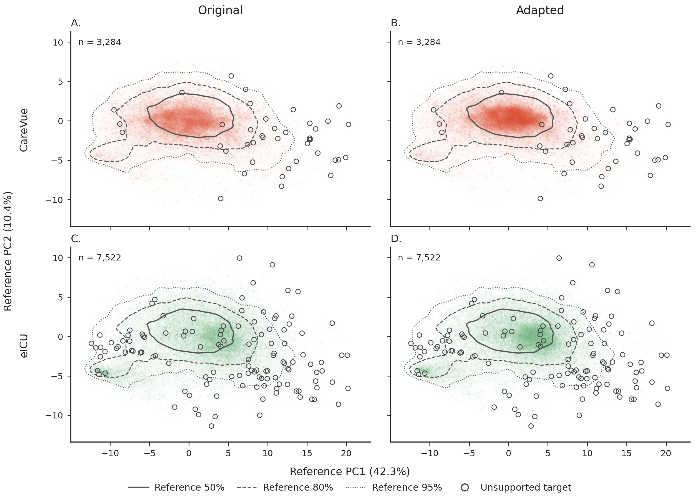

# ClinicalTensorSepsis: a harmonized multi-cohort temporal resource for Sepsis-3 research

This repository contains the pipeline used to construct, harmonize, reconstruct, and validate adult Sepsis-3 cohorts from MIMIC-IV, MIMIC-III CareVue, and eICU-CRD. It includes source-specific extraction, temporal imputation, representation learning, domain adaptation, statistical analysis, figure generation, and release packaging.

## Overview

ClinicalTensorSepsis represents 28,169 ICU stays on a common grid of 24 onset-relative hours and 50 clinical features. Observed and reconstructed values are stored separately, with observation counts, follow-up exposure, and per-cell provenance. A derived atlas provides 64-dimensional original and transport-adapted embeddings, using MIMIC-IV as the reference domain.

| Source | Version | Released ICU stays |
| --- | --- | ---: |
| MIMIC-IV | 3.1 | 17,287 |
| MIMIC-III CareVue | 1.4 | 3,288 |
| eICU-CRD | 2.0 | 7,594 |

The shared schema preserves source-specific differences in infection definitions, timing, and measurement evidence. The resource supports post-onset trajectory analysis, missing-data research, retrospective prognosis, and cross-database evaluation.

## Repository Structure

```text
ClinicalTensorSepsis/
├── src/
│   ├── 01_mimiciv_datasets/     # MIMIC-IV cohort, temporal data, imputation, and QC
│   ├── 02_mimic3_datasets/      # MIMIC-III CareVue construction and QC
│   ├── 03_eicu_datasets/        # eICU construction and QC
│   ├── 04_atlas_datasets/      # Temporal representation, transport, and atlas QC
│   ├── 05_statistical_analysis/ # Dataset validation and descriptive analyses
│   ├── 06_visualization/       # Main and supplementary figures
│   └── common/                 # Feature registry, measurement rules, and tensor schema
├── pipeline/
│   ├── 01_build_dataset.sh     # Run the complete workflow in dependency order
│   └── export_release.py      # Package validated data and release metadata
├── docker/                    # Dockerfile, Compose service, and pinned dependencies
├── Figures/                   # Selected manuscript figures
├── data/                      # Raw exports and generated intermediate data
├── outputs/                   # Models, reports, QC records, figures, and logs
├── release/                   # Generated archives and release documentation
├── LICENSE
└── README.md
```

`data/`, `outputs/`, and `release/` are local working directories excluded from Git. Configuration files under `src/` are part of the pipeline and should be kept with the corresponding code.

## Workflow


1. **Cohort construction:** Select eligible adult stays, identify suspected infection, annotate phenotypes, clean temporal measurements, and adjudicate the operational Sepsis-3 definition separately for each source.
2. **Temporal reconstruction:** Construct onset-aligned hourly tensors and train source-specific SAITS models. Validation-selected rules choose SAITS or a baseline method for each modeled feature. Observations remain unchanged, and structural hours after follow-up are never imputed.
3. **Representation and transport:** Fit a temporal encoder on MIMIC-IV training data and adapt supported CareVue and eICU embeddings using clinically constrained transport. Representation-ineligible patients retain their clinical records; unsupported target patients retain their original embeddings.
4. **Validation and release:** Evaluate coverage, reconstruction, transport, site heterogeneity, and sensitivity; generate figures; and export the validated tables with a data dictionary, cohort flow, and manifest.

## Getting Started

### 1. Clone the repository

```bash
git clone https://github.com/MrRajat1809/ClinicalTensorSepsis.git
cd ClinicalTensorSepsis
```

The pipeline uses Bash. Run it on Linux, in WSL, or inside the Docker container.

### 2. Obtain the source data

Obtain credentialed access to [MIMIC-IV v3.1](https://physionet.org/content/mimiciv/3.1/), the [MIMIC-III CareVue subset v1.4](https://physionet.org/content/mimic3-carevue/1.4/), and [eICU-CRD v2.0](https://physionet.org/content/eicu-crd/2.0/). Place or mount the raw table exports at these paths:

```text
data/raw/
├── mimiciv/3.1/
│   ├── hosp/*.csv.gz
│   └── icu/*.csv.gz
├── mimic3-carevue/1.4/*.csv.gz
└── eicu-crd/2.0/*.csv[.gz]
```

Use the CareVue-only release with its uppercase table filenames. For eICU, provide one copy of each table, either CSV or gzip-compressed CSV. The preflight check below identifies missing required tables. A full build needs no precomputed tensors, checkpoints, reports, or release files.

### 3. Choose an environment

#### Option A: Docker with NVIDIA GPU access

The Docker image uses PyTorch 2.2.1 with CUDA 12.1 and cuDNN 8. The Compose service reserves one NVIDIA GPU and requires [GPU access configured for Docker](https://docs.docker.com/compose/how-tos/gpu-support/).

From the repository root, start the service and open its shell:

```bash
docker compose -f docker/docker-compose.yml up --build -d
docker compose -f docker/docker-compose.yml exec sepsis_clinical bash
```

The repository is mounted at `/workspace`, which is also the container's working directory. Run the pipeline commands below in this shell. JupyterLab is available at `http://127.0.0.1:8888`; its startup URL and token appear in the service logs.

#### Option B: Local Python environment

Use an isolated Python 3.10 environment. The reference run used Python 3.10.13; direct dependencies are pinned in `docker/requirements.txt`.

```bash
python -m pip install -r docker/requirements.txt
```

For a local environment without CUDA, select `--device cpu` when running the pipeline. The supplied Docker Compose configuration requires a GPU.

### 4. Check inputs and run the pipeline

From the repository root in the selected environment:

```bash
bash pipeline/01_build_dataset.sh --check-only
bash pipeline/01_build_dataset.sh --device cuda
```

The first command checks dependencies, required raw tables, and output paths without running stages or writing outputs. Use `--device cpu` instead of `--device cuda` for CPU execution.

The build runs the three source pipelines, atlas construction, statistical analysis, visualization, and release export in dependency order. It stops on failure and appends an execution log to `outputs/logs/build_dataset.log`.

### 5. Resume or regenerate selected outputs

| Task | Command |
| --- | --- |
| Resume from eICU temporal extraction | `bash pipeline/01_build_dataset.sh --from eicu:04 --device cuda` |
| Regenerate all figures from completed analysis artifacts | `bash pipeline/01_build_dataset.sh --from visualization:01 --no-export` |
| Package completed, QC-passed datasets | `bash pipeline/01_build_dataset.sh --export-only` |
| Inspect the planned commands without execution | `bash pipeline/01_build_dataset.sh --dry-run` |
| View all options and input requirements | `bash pipeline/01_build_dataset.sh --help` |

`--from` runs the selected stage and all subsequent stages. Earlier artifacts must already exist and match the current code and configuration. Resume from the earliest affected stage after a change; shared visualization changes require regenerating all visualization stages before their final QC.

## Outputs

| Location | Contents |
| --- | --- |
| `data/processed/{mimiciv,mimic3-carevue,eicu}/` | Cohort records, cleaned events, temporal tensors, and source-level intermediates. |
| `data/processed/atlas/` | Inputs and derived data for the shared representation. |
| `outputs/{mimiciv,mimic3-carevue,eicu,atlas}/` | Models, preprocessing artifacts, manifests, and QC reports. |
| `outputs/statistical_analysis/` | Dataset validation results, descriptive summaries, and plot data. |
| `outputs/visualization/` | Final joined main and supplementary figures as PDF and 300 dpi PNG, with figure data and QC metadata. |
| `outputs/visualization/panels/` | Individual figure panels. |
| `release/` | Three source archives, `atlas.zip`, `data_dictionary.csv`, `cohort_flow.csv`, and `release_manifest.json`. |

The release archives contain gzip-compressed CSV tables. Source archives provide patient records, observed values, reconstructed values, and hourly support; the atlas archive provides patient metadata, original and adapted embeddings, and observed trajectory summaries. All 28,169 stays are retained, including 153 without an atlas embedding.



*Original and adapted embeddings on MIMIC-IV training principal-component axes. Unsupported patients retain their original coordinates.*

## Study Design and Interpretation

- **Cohort definitions:** MIMIC uses culture–antimicrobial pairing, while the primary eICU cohort uses documented infection and an antimicrobial order. A strict-culture eICU indicator supports sensitivity analysis without changing the released hourly alignment.
- **Follow-up and missingness:** Distinguish observed values, reconstructions, unresolved gaps, and structural hours using observation counts, exposure, and method codes. Artificial masking evaluates reconstruction of observed targets, not accuracy at naturally missing locations.
- **Prediction timing:** SAITS may use later observations within the 24-h window, and embeddings summarize that window. Earlier prediction tasks require time-restricted inputs and reconstruction.
- **Evaluation partitions:** Supplied partitions preserve the separation used for model development. Alternative splits require refitting preprocessing and learned components; patient-level eICU partitions are not hospital-held-out evaluation.
- **Transport:** Mappings use target training and validation data. They represent adaptation to a known database, and the descriptive atlas groups are not validated clinical phenotypes.

## Technologies

| Component | Libraries |
| --- | --- |
| Data processing | NumPy, pandas, PyArrow, DuckDB |
| Statistical analysis | SciPy, scikit-learn |
| Imputation and representation | PyTorch, PyPOTS / SAITS |
| Optimal transport | POT |
| Visualization | Matplotlib, Pillow |
| Environment and execution | Docker, Docker Compose, Bash, JupyterLab |

## Computational Requirements

The reference workflow ran on a workstation with a 4-core CPU, 8 GB RAM, and an NVIDIA GTX 1650 Ti with 4 GB video memory. CPU execution is supported through `--device cpu`. Full builds include model training and require storage for the raw exports, intermediate data, models, reports, and release archives.

Dependency pins describe the reported working environment; they do not lock every transitive dependency. Fresh runs can differ with hardware, runtime, and training behavior, so regenerated artifacts are not expected to be byte-identical. Manifests and QC records track the files used in each run.

## Data Availability

The repository contains processing code and selected figures. Credentialed source data and generated patient-level artifacts are excluded from Git. Release packages are prepared for PhysioNet; repository accession and publication details will be added when available. Exported CSV tables support downstream analysis but do not replace the intermediate artifacts and checkpoints required to resume this pipeline.

## License

The source code is distributed under the [MIT License](LICENSE). Credentialed source and derived data remain subject to the applicable PhysioNet licenses and data-use agreements.

## Contact

**Author:** Priyanshu Kumar  
**Repository:** [MrRajat1809/ClinicalTensorSepsis](https://github.com/MrRajat1809/ClinicalTensorSepsis)
